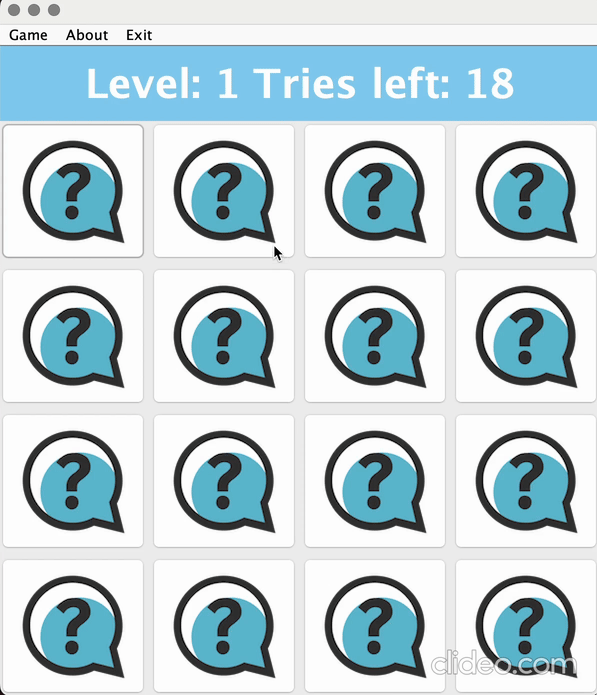

# Memory Card Game

<div align="center">



[](https://www.oracle.com/java/)
[]()
[](LICENSE)

**A classic memory matching card game built with Java Swing featuring multiple difficulty levels, score tracking, and a sleek user interface.**

[Features](#-features) • [Installation](#-installation) • [How to Play](#-how-to-play) • [Project Structure](#-project-structure) • [Contributing](#-contributing)

</div>

---

## About The Project

Memory Card Game is a fun and challenging puzzle game that tests your memory skills. The objective is simple: find all matching pairs of cards by remembering their positions. The game features three progressively difficult levels, each with unique themes and increasing challenges.

This project was developed as part of a university coursework, demonstrating proficiency in Java programming, object-oriented design, GUI development with Swing, and file I/O operations.

---

## Features

### Core Gameplay

- **Classic Memory Mechanics** — Flip cards to find matching pairs
- **4×4 Game Board** — 16 cards with 8 unique pairs per level
- **Card Preview** — All cards are revealed for 1 second at the start of each level
- **Smooth Animations** — Visual feedback with flip animations and timed delays

### Three Difficulty Levels

| Level | Theme              | Tries | Match Bonus | Mismatch Penalty | Special Mechanic             |
| :---: | :----------------- | :---: | :---------: | :--------------: | :--------------------------- |
| **1** | Internet & Web     |  18   |  +5 points  |     -1 point     | Standard gameplay            |
| **2** | Cybersecurity      |  15   |  +4 points  |    -2 points     | Fewer attempts               |
| **3** | Gaming & Computers |  12   |  +3 points  |    -3 points     | Cards reshuffle on mismatch! |

### Scoring System

- **Progressive Scoring** — Points accumulate across all three levels
- **Persistent High Scores** — Top 10 scores saved locally
- **Leaderboard** — View the highest scores achieved

### User Interface

- **Stylish Main Menu** — Custom-designed with background imagery
- **Color-Coded Levels** — Visual distinction between difficulty levels
  - Level 1: Light Blue
  - Level 2: Purple
  - Level 3: Red
- **Menu Bar Navigation** — Quick access to restart, high scores, and game info
- **Responsive Dialogs** — Instructions, level selection, and score displays

### Additional Features

- **Restart Functionality** — Start fresh from Level 1 anytime
- **Exit Options** — Return to main menu or close the application
- **About Section** — Developer and game information

---

## Installation

### Prerequisites

- **Java Development Kit (JDK) 11** or higher
- Any Java IDE (Eclipse, IntelliJ IDEA, VS Code) or command line

### Option 1: Clone and Run

```bash
# Clone the repository
git clone https://github.com/beyzaelbb/Memory-Card-Game.git

# Navigate to the project directory
cd Memory-Card-Game

# Compile the source files
javac -d bin src/game/*.java

# Run the game
java -cp bin game.Main
```

### Option 2: Using Eclipse IDE

1. Open Eclipse IDE
2. Go to **File → Import → General → Existing Projects into Workspace**
3. Select the `Memory-Card-Game` folder
4. Click **Finish**
5. Right-click on `Main.java` → **Run As → Java Application**

### Option 3: Using IntelliJ IDEA

1. Open IntelliJ IDEA
2. Select **Open** and choose the `Memory-Card-Game` folder
3. Wait for the project to index
4. Navigate to `src/game/Main.java`
5. Click the green **Run** button or press `Shift + F10`

### Option 4: Using VS Code

1. Install the **Extension Pack for Java**
2. Open the `Memory-Card-Game` folder
3. Open `src/game/Main.java`
4. Click **Run** above the `main` method

---

## How to Play

### Getting Started

1. Launch the game by running `Main.java`
2. Click **Start Game** to begin from Level 1, or
3. Click **Select Level** to choose a specific starting level
4. Read the **Instructions** if you're new to the game

### Gameplay

1. **Memorize** — At the start, all cards are briefly revealed (1 second)
2. **Click** — Select a card to flip it over
3. **Match** — Click a second card to find its pair
4. **Score** — Matching pairs earn points; mismatches cost points and tries
5. **Progress** — Complete all pairs to advance to the next level
6. **Win** — Beat all three levels to achieve your final score!

### Tips for Success

- Focus on remembering card positions during the initial reveal
- Develop a systematic approach to checking cards
- Be extra careful in Level 3 — cards reshuffle after every mismatch!
- Minimize mismatches to maximize your score

---

## 📁 Project Structure

```
Memory-Card-Game/
│
├──  src/
│   ├──  game/
│   │   ├──  Main.java          # Application entry point
│   │   ├──  Menu.java          # Main menu screen & navigation
│   │   ├──  Game.java          # Core game logic & flow control
│   │   ├──  Cards.java         # Card component (extends JButton)
│   │   ├──  BoardGui.java      # Game board UI & interactions
│   │   └──  ScoreBoard.java    # High score management & persistence
│   │
│   ├──  assets/
│   │   ├──  background.jpg                  # Menu background image
│   │   ├──  Level1-InternetAssets/          # Level 1 card images
│   │   ├──  Level2-CyberSecurityAssets/     # Level 2 card images
│   │   └──  Level3-GamingComputerAssets/    # Level 3 card images
│   │
│   └──  module-info.java       # Java module configuration
│
├──  .gitignore                 # Git ignore rules
├──  README.md                  # Project documentation
└──  highscores.txt             # Persistent score data (generated at runtime)
```

### Class Descriptions

| Class        | Responsibility                                                        |
| ------------ | --------------------------------------------------------------------- |
| `Main`       | Entry point; initializes the application                              |
| `Menu`       | Handles main menu display and user navigation                         |
| `Game`       | Manages game state, card initialization, shuffling, and scoring logic |
| `Cards`      | Custom JButton representing a single card with flip functionality     |
| `BoardGui`   | Renders the game board, handles user input, and displays game status  |
| `ScoreBoard` | Manages reading/writing high scores to file system                    |

---

## Technologies Used

- **Language:** Java 11+
- **GUI Framework:** Java Swing
- **Architecture:** Object-Oriented Design
- **Build System:** Eclipse IDE / Manual compilation
- **Version Control:** Git

---

## Contributing

Contributions are welcome! Here's how you can help improve this project:

1. **Fork** the repository
2. **Create** a feature branch (`git checkout -b feature/AmazingFeature`)
3. **Commit** your changes (`git commit -m 'Add some AmazingFeature'`)
4. **Push** to the branch (`git push origin feature/AmazingFeature`)
5. **Open** a Pull Request

### Ideas for Contributions

- [ ] Add sound effects and background music
- [ ] Implement additional difficulty levels
- [ ] Create new card theme packs
- [ ] Add multiplayer support
- [ ] Implement a timer mode
- [ ] Add card flip animation effects
- [ ] Create a settings menu for customization

---

## License

This project is licensed under the MIT License - see the [LICENSE](LICENSE) file for details.

## Acknowledgments

- Card assets sourced from various free icon libraries
- Inspired by the classic Memory/Concentration card game
- Built as part of university coursework

---

<div align="center">

**⭐ If you enjoyed this game, please give it a star! ⭐**

Made with ❤️ and Java

</div>
